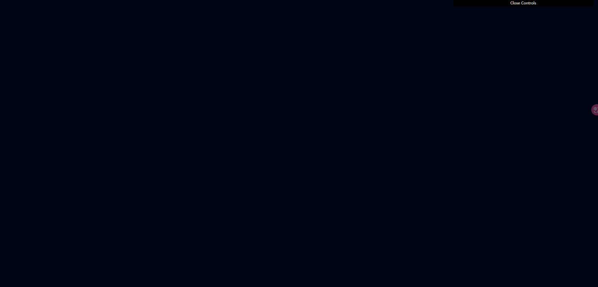
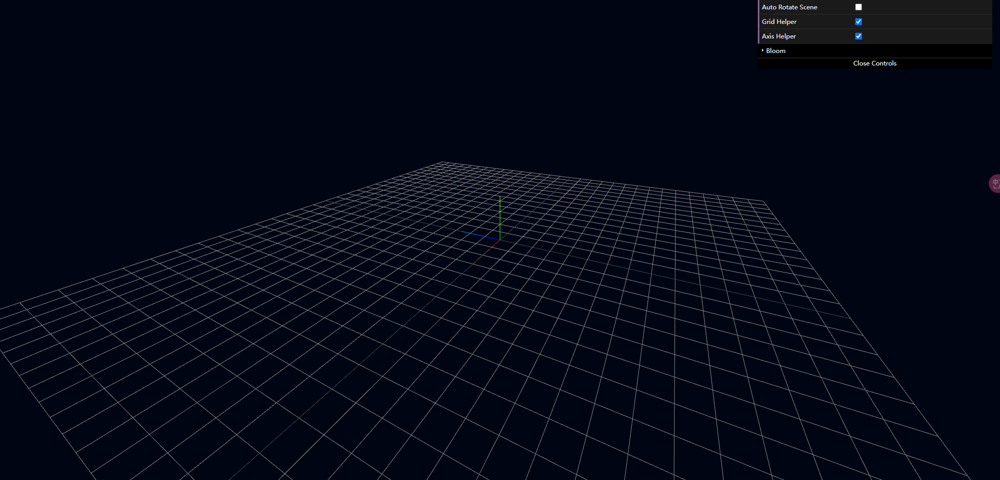

# WebGL 构建一个地日运动场景镜头

> 这是我通过学习、整理了一个 WebGL 开源小 Demo，展示了地球绕太阳的公转运动。
>
> 例子虽然很简单，希望大家能喜欢！
>
> - [查看地址](https://webgl-skydiving.vercel.app/)
> - [仓库地址](https://github.com/sebastien-lempens/webgl-skydiving)

<br />

## 介绍


如图所示，站在地球的远处，眺望那绵延的星辰，繁星闪烁如同点点泪珠，不禁让人热泪盈眶。一个蔚蓝的地球谦卑地环绕着恒星太阳运动，宛如宇宙的明珠，静静闪烁，这运动是地球上生命和自然界运行的基础之一，深刻影响着地球的季节变化、昼夜交替和气候分布。

在这宇宙里，我们或许微不足道的存在，但我们要相信自己拥有无限的可能与力量，是我们面对宇宙、对未来始终要怀抱的信念，勇往直前~~

<br />

## 思路

> 好了以下，介绍一下开发历程：

1. 创建 ThreeJS 空间的必要素：场景`THREE.Scene`、渲染器`THREE.WebGLRenderer`、透视投影相机`THREE.PerspectiveCamera`



```ts
const scene = new THREE.Scene();
scene.background = new THREE.Color(0x000514);

const camera = new THREE.PerspectiveCamera(
  75,
  window.innerWidth / window.innerHeight,
  0.1,
  100
);
camera.position.set(0.5 * 1.8, 0 * 1.8, 3 * 1.8);

const renderer = new THREE.WebGLRenderer({ antialias: true });
renderer.shadowMap.enabled = true;
renderer.setPixelRatio(Math.min(window.devicePixelRatio, 2));
renderer.setSize(window.innerWidth, window.innerHeight);
```

<br />

2. 向 ThreeJS 空间添加参照系：网格辅助线`THREE.GridHelper`、坐标轴辅助线`THREE.AxesHelper`



```ts
const gridHelper = new THREE.GridHelper(20, 30);
gridHelper.visible = false;
scene.add(gridHelper);

const axis = new THREE.AxesHelper(1.75);
axis.visible = false;
scene.add(axis);

gui.add(gridHelper, "visible").name("Grid Helper");
gui.add(axis, "visible").name("Axis Helper");
```

<br />

3. 向 ThreeJS 空间添加地球网格（还配置光、以便让物体可视）：环境光`THREE.AmbientLigh`、直射光`THREE.DirectionalLight`、地球`THREE.Mesh`


```ts
const ambientLight = new THREE.AmbientLight(0xffffff, 0.3);
scene.add(ambientLight);

const directionalLight = new THREE.DirectionalLight(0xffffff, 1.2);
directionalLight.position.set(-5, 2, 0);
directionalLight.castShadow = true;
scene.add(directionalLight);
```

```ts
const earthMap = new THREE.TextureLoader().load("./earthMap.jpg");

const earth = new THREE.Mesh(
  new THREE.SphereGeometry(1, 64, 64),
  new THREE.MeshStandardMaterial({
    color: 0xffffff,
    map: earthMap,
    bumpMap: earthMap,
    bumpScale: 0.018,
    metalness: 0.3,
    roughness: 0.7,
  })
);

earth.userData = {
  color: new THREE.Color().copy(earth.material.color),
};
```

<br />

4. 向 ThreeJS 空间添加地球大气网格：地球大气`THREE.Mesh`


```ts
const cloudMap = new THREE.TextureLoader().load("./cloudMap.jpg");

const cloud = new THREE.Mesh(
  new THREE.SphereGeometry(1, 64, 64),
  new THREE.MeshStandardMaterial({
    map: cloudMap,
    alphaMap: cloudMap,
    bumpScale: 0.015,
    transparent: true,
    depthWrite: false,
    opacity: 0.2,
  })
);
cloud.scale.set(1.025, 1.025, 1.025);

cloud.userData = {
  color: new THREE.Color().copy(cloud.material.color),
};
```

<br />

5. 向 ThreeJS 空间添加太阳光晕：透镜耀斑`Lensflare`、透镜耀斑元素`LensflareElement`

> 在 Three.js 中，`Lensflare`（透镜耀斑）是一种用于模拟透镜效果的特效。它模拟了当光线直接进入镜头时，由于光线的折射和散射而产生的光晕效果。
>
> 在 Three.js 中，`LensflareElement`（透镜耀斑元素）是用于创建`Lensflare`（透镜耀斑）效果中的耀斑元素的类。LensflareElement 用于表示耀斑效果中的每个光斑。


```ts
const lensflareTexture = new THREE.TextureLoader().load("./lensFlares.png");
const lensflareColor = new THREE.Color(0xffffff);
const lensflare = new Lensflare();
const lensflareElement = new LensflareElement(
  lensflareTexture,
  300 * directionalLight.intensity,
  0,
  lensflareColor
);
```

<br />

6. 向 ThreeJS 空间添加繁星点点：点精灵`THREE.Points`


```ts
const pointsCount = 1500;
const pointsGeo = new THREE.BufferGeometry();
const pointsPos = new Float32Array(pointsCount * 3);

for (let i = 0; i < pointsCount * 3; i++) {
  pointsPos[i] = (Math.random() - 0.5) * 15;
}
pointsGeo.setAttribute("position", new THREE.BufferAttribute(pointsPos, 3));

const pointsMat = new THREE.PointsMaterial({
  size: 0.015,
  sizeAttenuation: true,
  color: 0xffffff,
});

const points = new THREE.Points(pointsGeo, pointsMat);
```

- 定义了点精灵的数量为 1500 个。
- 创建了一个 BufferGeometry 对象，用于存储点精灵的几何信息。
- 创建了一个长度为 4500 的 Float32Array 数组，用于存储每个点精灵的位置信息。
- 通过 BufferGeometry.setAttribute 方法，将长度为 4500 的 Float32Array 数组的位置添加到 THREE.BufferGeometry 对象的属性（position）。
- 创建了一个 PointsMaterial 对象，用于定义点精灵的材质属性。。
- 最后，创建 THREE.Points，设置其 geometry、material 信息。

<br />

7. 向 ThreeJS 空间添加后期美化处理：

> 其实，做到以上步骤已经可以了，但是为了让全景效果更好，我还是添加了后期处理，这里要注意`UnrealBloomPass`的处理，以下代码说明：


```ts
class SelectiveBloom {
  params: {
    exposure: number;
    bloomStrength: number;
    bloomThreshold: number;
    bloomRadius: number;
  };
  renderScene: RenderPass;
  bloomPass: UnrealBloomPass;
  bloomComposer: EffectComposer;
  finalPass: ShaderPass;
  finalComposer: EffectComposer;
  constructor(
    scene: THREE.Scene,
    camera: THREE.Camera,
    renderer: THREE.WebGLRenderer
  ) {
    this.params = {
      exposure: 1,
      bloomStrength: 3.0,
      bloomRadius: 0.145,
      bloomThreshold: 0.203,
    };

    this.renderScene = new RenderPass(scene, camera);

    this.bloomPass = new UnrealBloomPass(
      new Vector2(window.innerWidth, window.innerHeight),
      1.5,
      0.0,
      0.0
    );
    this.bloomPass.strength = this.params.bloomStrength;
    this.bloomPass.radius = this.params.bloomRadius;
    this.bloomPass.threshold = this.params.bloomThreshold;

    this.bloomComposer = new EffectComposer(renderer);
    this.bloomComposer.renderToScreen = false;
    this.bloomComposer.addPass(this.renderScene);
    this.bloomComposer.addPass(this.bloomPass);

    this.finalPass = new ShaderPass(
      new ShaderMaterial({
        uniforms: {
          baseTexture: { value: null },
          bloomTexture: { value: this.bloomComposer.renderTarget2.texture },
        },
        vertexShader: `
          varying vec2 vUv; 
          void main() {
            vUv = uv;gl_Position = projectionMatrix * modelViewMatrix * vec4( position, 1.0 );
          }
        `,
        fragmentShader: `
          uniform sampler2D baseTexture; 
          uniform sampler2D bloomTexture; 
          varying vec2 vUv; 
          void main() {
            gl_FragColor = ( texture2D( baseTexture, vUv ) + vec4( 1.0 ) * texture2D( bloomTexture, vUv ) );
          }
        `,
        defines: {},
      }),
      "baseTexture"
    );
    this.finalPass.needsSwap = true;

    this.finalComposer = new EffectComposer(renderer);
    this.finalComposer.addPass(this.renderScene);
    this.finalComposer.addPass(this.finalPass);
  }
}
```

```ts
const animate = () => {
  stats.begin();
  const elapsedTime = clock.getElapsedTime();
  earth.rotation.y = elapsedTime / 10;
  cloud.rotation.y = elapsedTime / 10;

  if (earth) {
    earth.material.color.set(0x000000);
    cloud.material.color.set(0x000000);
    lensflareElement.color.set(0x000000);
    scene.background = null;
  }

  renderer.setClearColor(0x000000);
  selectiveBloom.bloomComposer.render();

  if (earth) {
    earth.material.color.set(earth.userData.color);
    cloud.material.color.set(cloud.userData.color);
    lensflareElement.color.set(0xffffff);
    scene.background = new THREE.Color(0x000514);
  }

  renderer.setClearColor(0x1d1d1d);
  selectiveBloom.finalComposer.render();

  // renderer.render(scene, camera);
  stats.end();

  controls.update();
  requestAnimationFrame(animate);
};
```

> 我使用了`selectiveBloom.bloomComposer.render()`、`selectiveBloom.finalComposer.render()`两次渲染处理，来使繁星闪烁、但又能避免其他物体被曝光（以后我说一下，我之前遇到的 Three.UnrealBloomPass 问题）。

<br />

## 最终效果


我们的世界，在幽寂无声的宇宙之中，那个蔚蓝的星球缓缓地环绕着恒星太阳舞蹈！

<br />

## 相关资料

- [Three.js](https://threejs.org/)
- [codepen.io](https://codepen.io/devXprite/pen/ExGaxMX)
